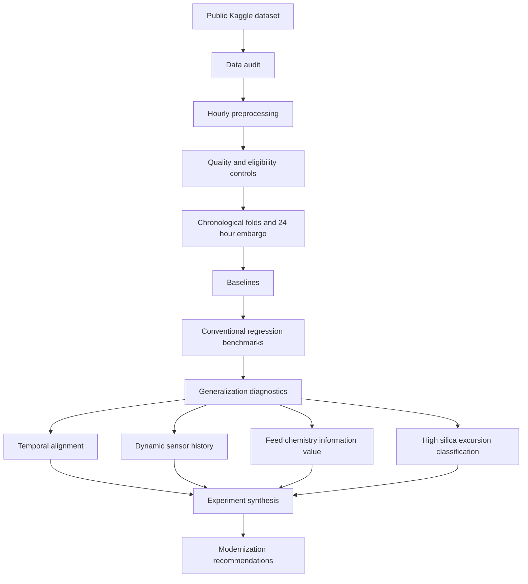

# Mining Quality Prediction

An end to end data science investigation of forward silica prediction in an iron ore flotation process.

## Overview

Iron ore flotation operators rely on laboratory measurements of concentrate quality. This project investigates whether historically recorded process conditions can estimate `% Silica Concentrate` before the hourly laboratory result is available. A reliable estimate could provide earlier visibility into changing concentrate quality.

The raw data contain strong temporal dependence. Up to 180 process records share each recorded hour, while concentrate targets repeat or follow near exact interpolation and feed chemistry changes in coarse blocks. The project therefore uses expanding chronological development folds with a 24 hour embargo instead of random row splitting.

The conclusion is direct: no evaluated formulation demonstrated sufficiently reliable forward performance for promotion. Random Forest was the strongest conventional regression benchmark, but its relationships did not transport consistently across time. The central empirical result is temporal instability and poor predictor to target transportability, not a production model.

## Key findings

* Random Forest was the strongest conventional regression benchmark, with mean development RMSE of `0.9358` and mean R squared of `-0.0333`.
* Gradient Boosted Trees increased mean RMSE to `1.0661` and did not improve the Random Forest result.
* Shifting the target by one or two hours lowered headline RMSE on different row populations but worsened mean R squared. The supported decision retained the 0 hour alignment.
* Dynamic sensor history improved mean RMSE by only `0.0095`, with improvement in two folds and deterioration in one.
* Historical feed chemistry increased exact regression RMSE by `0.0234` on average. It provided modest additional excursion ranking information, but not a reliable warning rule.
* The feed enhanced classifier reached mean PR AUC of `0.1805` and ROC AUC of `0.6248`, yet both classifier configurations produced zero recall at the fixed probability threshold.
* Weak and unstable predictor relationships recurred across the chronological folds. Increasing model complexity did not resolve that information limitation.

## Why chronological validation matters

A random row split would place closely related observations on both sides of evaluation. Each recorded hour contains up to approximately 180 raw rows. The target is usually repeated within an hour and otherwise follows near exact interpolation. Identical target values can persist across hours, and feed chemistry occurs in low frequency blocks. These structures violate the independence assumed by random row validation and can inflate apparent sample size and performance.

Development evaluation uses three expanding chronological folds. Training always precedes validation, and a 24 hour embargo separates their timestamps. Fold boundaries also respect temporal segments and repeated target runs. A later final test period remains reserved because no candidate met the development standard for promotion. The unused test period is a deliberate validation control, not an omitted evaluation.

## Data

The project uses the public Kaggle dataset *Quality Prediction in a Mining Process*, which records an iron ore reverse flotation process from March through September 2017. The source includes high frequency reagent, pulp, air flow, and column level measurements, with concentrate silica measured hourly. The repository transforms the raw records into 4,097 hourly timestamps.

`% Silica Concentrate` is the prediction target. `% Iron Concentrate` is excluded from predictors because it is a concentrate outcome from the same process stage and assay context. Historical feed chemistry is evaluated only for information value because its availability at prediction time is not verified.

See [the dataset provenance document](docs/DATASET.md) for source, license, acquisition, measurement structure, and audit limitations.

## Technical workflow



The controlled experiments branch from the common development evidence. They are comparative investigations, not sequential promotion stages.

## Modeling and experiments

| Experiment | Purpose | Main result | Decision |
| --- | --- | --- | --- |
| Baselines | Establish nonmodel references | Training mean RMSE `0.9669`; optimistic persistence RMSE `0.7536` | Retain both references; do not treat persistence as a verified operator baseline |
| Linear Regression | Test stable linear signal in 57 sensor features | RMSE `0.9530`; R squared `-0.0706` | Linear relationships did not transport reliably |
| Random Forest | Test nonlinear relationships and interactions | RMSE `0.9358`; R squared `-0.0333` | Strongest conventional regression benchmark, but not reliable enough for promotion |
| Gradient Boosted Trees | Test sequential boosting against Random Forest | RMSE `1.0661`; R squared `-0.3460` | Additional complexity did not improve the benchmark |
| Temporal alignment | Compare targets at 0, 1, and 2 hour alignments | RMSE `0.9358`, `0.9163`, and `0.9117`; shifted rows differed | Retain 0 hour alignment because shifted comparisons were not like for like |
| Generalization diagnostics | Examine drift and relationship stability | 25 predictors had material drift; 15 relationships reversed; 2 weakened | Treat temporal instability as the central limitation |
| Dynamic representation | Add backward looking sensor history | Dynamic RMSE `0.9271` versus static `0.9366` | Improvement was small, inconsistent, and below the action margin |
| Feed chemistry value | Compare 57 sensor features with 59 feed enhanced features | Feed enhanced RMSE `0.9592` versus sensor only `0.9358` | Historical feed chemistry worsened exact regression |
| Excursion classification | Reframe the task as high silica ranking and warning | Feed enhanced PR AUC `0.1805`; ROC AUC `0.6248`; zero recall at `0.50` | Modest ranking information did not produce a reliable warning rule |

The [experiment ledger](docs/EXPERIMENT_LEDGER.md) contains the complete validation record, interpretation, and experiment constraints.

## What the diagnostics showed

Predictor to target relationships were weak before considering stability. Mean absolute Spearman association was `0.071` in training and `0.067` in validation. Of 57 predictors, 25 had mean absolute standardized drift of at least `0.25`. Fifteen relationships showed a material reversal and two weakened under the project classification rules.

These measurements support a transportability finding: predictor levels changed, and already weak associations did not remain stable across later operating periods. They do not identify a single cause. More complex models can represent richer functions, but they cannot by themselves make unstable historical information relationships transport forward.

## Modernization direction

### Historical evidence

The historical process sensors, short process history, and recorded feed fields did not support reliable forward prediction of exact silica concentration. Feed chemistry showed some additional association with high silica ranking, but that evidence was inconsistent across periods and did not support a fixed threshold warning rule.

### Proposed modern system

A future measurement and monitoring system should establish a stronger information layer before increasing model complexity. A plausible design would include:

* synchronized high frequency process measurements
* explicit assay sampling and result availability timestamps
* material residence or process delay alignment
* continuous feed composition measurement where operationally available
* automated data quality checks
* time aligned feature generation
* calibrated risk outputs and threshold selection using dedicated validation data
* drift monitoring across operating regimes
* prospective chronological validation

Continuous online feed composition is a proposed measurement improvement. This historical dataset does not validate it as a solution. Prospective data would need to confirm measurement availability, timing, stability, and value under future operating conditions.

## Repository structure

| Path | Purpose |
| --- | --- |
| `src/data/` | Raw ingestion, hourly preprocessing, dynamic features, and chronological splits |
| `src/models/` | Baselines, regression benchmarks, diagnostics, and controlled experiments |
| `tests/` | Unit, guard, determinism, and real artifact validation |
| `notebooks/` | Reproducible exploratory data audit |
| `docs/` | Dataset provenance and authoritative experiment record |
| `results/` | Tracked, human readable development metrics and diagnostic summaries |
| `scripts/` | Public dataset acquisition |

## Reproducing the project

Create and activate the environment from the repository root:

```bash
conda env create -f environment.yml
conda activate mining-ml
```

Configure valid Kaggle CLI authentication before downloading the public dataset. Then build the local raw and processed data layers:

```bash
./scripts/download_data.sh
python -m src.data.preprocess
python -m src.data.split
```

Run the conventional benchmark chain in dependency order:

```bash
python -m src.models.baselines
python -m src.models.linear_regression
python -m src.models.random_forest
python -m src.models.gradient_boosted_trees
```

Run controlled development experiments individually as needed:

```bash
python -m src.models.temporal_alignment
python -m src.models.generalization_diagnostics
python -m src.data.dynamic_features
python -m src.models.dynamic_representation
python -m src.models.feed_chemistry_value
python -m src.models.excursion_classifier
```

These modules evaluate the development folds and write detailed local artifacts under `data/processed/`. They do not score the reserved final test period. Run the test suite with:

```bash
pytest
```

## Results and documentation

* [`results/`](results/) provides concise CSV evidence for the principal development metrics.
* [`docs/EXPERIMENT_LEDGER.md`](docs/EXPERIMENT_LEDGER.md) records experiment questions, controls, results, decisions, and interpretive limits.
* [`docs/DATASET.md`](docs/DATASET.md) records provenance, licensing, acquisition, measurement structure, and known data limitations.
* [`notebooks/01_data_audit.ipynb`](notebooks/01_data_audit.ipynb) reproduces the raw data quality and temporal structure audit.

## Tools

The core stack is Python 3.13, pandas, NumPy, PySpark and Spark ML, PyArrow, matplotlib, and pytest. OpenJDK 17 supports the local Spark runtime, and the Kaggle CLI provides data acquisition.

## Project conclusion

No evaluated regression or classification formulation demonstrated sufficiently reliable forward performance under the chronological development standard. The project therefore does not promote a predictive model.

The evidence redirects the engineering problem toward measurement quality, information timing, and temporal transportability. Better synchronized measurements, explicit availability timestamps, and prospective data are required before a modernized silica prediction or risk monitoring system can be validated.
